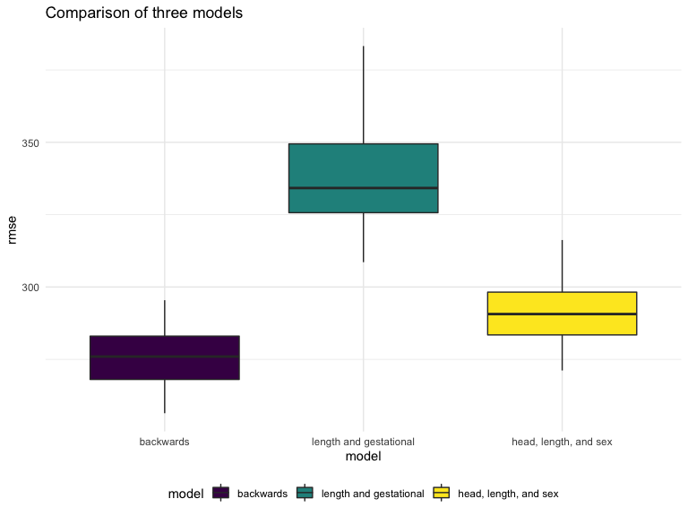

p8105_hw6_hc3212
================
Hening CUi
12/1/2021

    ## ── Attaching packages ─────────────────────────────────────── tidyverse 1.3.1 ──

    ## ✓ ggplot2 3.3.5     ✓ purrr   0.3.4
    ## ✓ tibble  3.1.5     ✓ dplyr   1.0.7
    ## ✓ tidyr   1.1.4     ✓ stringr 1.4.0
    ## ✓ readr   2.0.2     ✓ forcats 0.5.1

    ## ── Conflicts ────────────────────────────────────────── tidyverse_conflicts() ──
    ## x dplyr::filter() masks stats::filter()
    ## x dplyr::lag()    masks stats::lag()

    ## Loading required package: viridisLite

    ## Loading required package: nlme

    ## 
    ## Attaching package: 'nlme'

    ## The following object is masked from 'package:dplyr':
    ## 
    ##     collapse

    ## This is mgcv 1.8-38. For overview type 'help("mgcv-package")'.

    ## 
    ## Attaching package: 'MASS'

    ## The following object is masked from 'package:dplyr':
    ## 
    ##     select

## Problem 1

First import and clean the data.

``` r
baby_df = 
  read_csv("birthweight.csv") %>% 
  drop_na() %>% 
  mutate(
    babysex = as.factor(babysex),
    frace = as.factor(frace),
    mrace = as.factor(mrace),
  ) %>% 
  dplyr::select(-pnumlbw, -pnumsga)
```

I use the backwards elimination to creat the optimal linear regression.
Firstly, all the predictor was included to generate the linear
regression. Then the less significant predictor was removed, which
p-value less than SL(0.05). The final model contains babysex, bhead,
blength, delwt, fincome,  
gaweeks, mheight, mrace, parity, ppwt and smoken.

``` r
mult.fit = lm(bwt ~ ., data = baby_df)
summary(mult.fit)
```

    ## 
    ## Call:
    ## lm(formula = bwt ~ ., data = baby_df)
    ## 
    ## Residuals:
    ##      Min       1Q   Median       3Q      Max 
    ## -1097.68  -184.86    -3.33   173.09  2344.15 
    ## 
    ## Coefficients: (1 not defined because of singularities)
    ##               Estimate Std. Error t value Pr(>|t|)    
    ## (Intercept) -6265.3914   660.4011  -9.487  < 2e-16 ***
    ## babysex2       28.7073     8.4652   3.391 0.000702 ***
    ## bhead         130.7781     3.4523  37.881  < 2e-16 ***
    ## blength        74.9536     2.0217  37.075  < 2e-16 ***
    ## delwt           4.1007     0.3948  10.386  < 2e-16 ***
    ## fincome         0.2898     0.1795   1.614 0.106551    
    ## frace2         14.3313    46.1501   0.311 0.756168    
    ## frace3         21.2361    69.2960   0.306 0.759273    
    ## frace4        -46.9962    44.6782  -1.052 0.292912    
    ## frace8          4.2969    74.0741   0.058 0.953745    
    ## gaweeks        11.5494     1.4654   7.882 4.06e-15 ***
    ## malform         9.7650    70.6259   0.138 0.890039    
    ## menarche       -3.5508     2.8951  -1.226 0.220083    
    ## mheight         9.7874    10.3116   0.949 0.342588    
    ## momage          0.7593     1.2221   0.621 0.534418    
    ## mrace2       -151.4354    46.0453  -3.289 0.001014 ** 
    ## mrace3        -91.3866    71.9190  -1.271 0.203908    
    ## mrace4        -56.4787    45.1369  -1.251 0.210901    
    ## parity         95.5411    40.4793   2.360 0.018307 *  
    ## ppbmi           4.3538    14.8913   0.292 0.770017    
    ## ppwt           -3.4716     2.6121  -1.329 0.183913    
    ## smoken         -4.8544     0.5871  -8.269  < 2e-16 ***
    ## wtgain              NA         NA      NA       NA    
    ## ---
    ## Signif. codes:  0 '***' 0.001 '**' 0.01 '*' 0.05 '.' 0.1 ' ' 1
    ## 
    ## Residual standard error: 272.5 on 4320 degrees of freedom
    ## Multiple R-squared:  0.7183, Adjusted R-squared:  0.717 
    ## F-statistic: 524.6 on 21 and 4320 DF,  p-value: < 2.2e-16

``` r
final.model <- stepAIC(mult.fit, direction = "both", trace = FALSE) 
summary(final.model)
```

    ## 
    ## Call:
    ## lm(formula = bwt ~ babysex + bhead + blength + delwt + fincome + 
    ##     gaweeks + mheight + mrace + parity + ppwt + smoken, data = baby_df)
    ## 
    ## Residuals:
    ##      Min       1Q   Median       3Q      Max 
    ## -1097.18  -185.52    -3.39   174.14  2353.44 
    ## 
    ## Coefficients:
    ##               Estimate Std. Error t value Pr(>|t|)    
    ## (Intercept) -6098.8219   137.5463 -44.340  < 2e-16 ***
    ## babysex2       28.5580     8.4549   3.378 0.000737 ***
    ## bhead         130.7770     3.4466  37.944  < 2e-16 ***
    ## blength        74.9471     2.0190  37.120  < 2e-16 ***
    ## delwt           4.1067     0.3921  10.475  < 2e-16 ***
    ## fincome         0.3180     0.1747   1.820 0.068844 .  
    ## gaweeks        11.5925     1.4621   7.929 2.79e-15 ***
    ## mheight         6.5940     1.7849   3.694 0.000223 ***
    ## mrace2       -138.7925     9.9071 -14.009  < 2e-16 ***
    ## mrace3        -74.8868    42.3146  -1.770 0.076837 .  
    ## mrace4       -100.6781    19.3247  -5.210 1.98e-07 ***
    ## parity         96.3047    40.3362   2.388 0.017004 *  
    ## ppwt           -2.6756     0.4274  -6.261 4.20e-10 ***
    ## smoken         -4.8434     0.5856  -8.271  < 2e-16 ***
    ## ---
    ## Signif. codes:  0 '***' 0.001 '**' 0.01 '*' 0.05 '.' 0.1 ' ' 1
    ## 
    ## Residual standard error: 272.3 on 4328 degrees of freedom
    ## Multiple R-squared:  0.7181, Adjusted R-squared:  0.7173 
    ## F-statistic: 848.1 on 13 and 4328 DF,  p-value: < 2.2e-16

``` r
baby_df%>% 
  add_predictions(final.model) %>% 
  add_residuals(final.model) %>% 
  ggplot(aes(x = pred, y = resid, alpha = 0.1)) +
  geom_point()
```


First, sampling…

``` r
baby_cv =
  crossv_mc(baby_df, 100) %>% 
  mutate(
    train = map(train, as_tibble),
    test = map(test, as_tibble)
  )
```

Next, Fit models

``` r
fit_df =
  baby_cv %>% 
  mutate(
    final_mod = map(.x = train, ~stepAIC(lm(bwt ~ ., data = .x), direction = "both", trace = FALSE)),
    len_mod = map(.x = train, ~lm(bwt ~ blength + gaweeks, data = .x)),
    hea_mod = map(.x = train, ~lm(bwt ~ bhead + blength + babysex, data = .x))
  ) %>% 
  mutate(
    rmsefinal = map2_dbl(.x = final_mod,.y = test, ~rmse(model = .x, data = .y)),
    rmselen = map2_dbl(.x = len_mod,.y = test, ~rmse(model = .x, data = .y)),
    rmsehea = map2_dbl(.x = hea_mod,.y = test, ~rmse(model = .x, data = .y))
  )
```

``` r
fit_df %>% 
  dplyr::select(starts_with("rmse")) %>% 
  pivot_longer(
    rmsefinal:rmsehea,
    names_to = "model",
    values_to = "rmse", 
    names_prefix = "rmse"
  ) %>% 
  ggplot(aes(x = model, y = rmse)) +
  geom_boxplot() +
  scale_x_discrete(labels = c("backwards", "length and gestational", "head, length, and sex"))
```



## Problem 2

``` r
weather_df = 
  rnoaa::meteo_pull_monitors(
    c("USW00094728"),
    var = c("PRCP", "TMIN", "TMAX"), 
    date_min = "2017-01-01",
    date_max = "2017-12-31") %>%
  mutate(
    name = recode(id, USW00094728 = "CentralPark_NY"),
    tmin = tmin / 10,
    tmax = tmax / 10) %>%
  dplyr::select(name, id, everything())
```

let’s bootstrap

``` r
weather_boot =
  weather_df %>% 
  drop_na() %>% 
  bootstrap(5000, id = "strap_number")%>% 
  mutate(
    models = map(.x = strap, ~lm(tmax ~ tmin, data = .x)),
    results = map(models, broom::tidy)
  ) %>% 
  dplyr::select(strap_number, results) %>% 
  unnest(results)
```

The boostrap is helpful when you’d like to perform inference for a
parameter / value / summary that doesn’t have an easy-to-write-down
distribution in the usual repeated sampling framework. We’ll focus on a
simple linear regression with tmax as the response and tmin as the
predictor, and are interested in the distribution of two quantities
estimated from these data:

r̂2 log(β̂0∗β̂1) Use 5000 bootstrap samples and, for each bootstrap sample,
produce estimates of these two quantities. Plot the distribution of your
estimates, and describe these in words. Using the 5000 bootstrap
estimates, identify the 2.5% and 97.5% quantiles to provide a 95%
confidence interval for r̂2 and log(β̂0∗β̂1) . Note: broom::glance() is
helpful for extracting r̂2 from a fitted regression, and broom::tidy()
(with some additional wrangling) should help in computing log(β̂0∗β̂1) .
