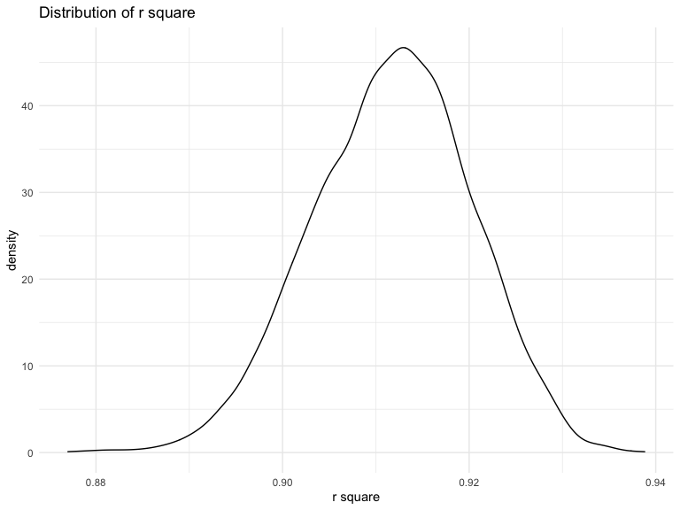

p8105_hw6_hc3212
================
Hening CUi
12/1/2021

    ## ── Attaching packages ─────────────────────────────────────── tidyverse 1.3.1 ──

    ## ✓ ggplot2 3.3.5     ✓ purrr   0.3.4
    ## ✓ tibble  3.1.5     ✓ dplyr   1.0.7
    ## ✓ tidyr   1.1.4     ✓ stringr 1.4.0
    ## ✓ readr   2.0.2     ✓ forcats 0.5.1

    ## ── Conflicts ────────────────────────────────────────── tidyverse_conflicts() ──
    ## x dplyr::filter() masks stats::filter()
    ## x dplyr::lag()    masks stats::lag()

    ## Loading required package: viridisLite

    ## Loading required package: nlme

    ## 
    ## Attaching package: 'nlme'

    ## The following object is masked from 'package:dplyr':
    ## 
    ##     collapse

    ## This is mgcv 1.8-38. For overview type 'help("mgcv-package")'.

    ## 
    ## Attaching package: 'MASS'

    ## The following object is masked from 'package:dplyr':
    ## 
    ##     select

## Problem 1

First import and clean the data.

``` r
race = c("White", "Black", "Asian", "Puerto Rican", "Other", "Unkown")

baby_df = 
  read_csv("birthweight.csv") %>% 
  mutate(
    babysex = factor(recode(babysex, `1` = "male", `2` = "female")),
    malform = factor(recode(malform, `0` = "absent", `1` = "present")),
    frace = factor(race[frace]),
    mrace = factor(race[mrace])
  ) %>% 
  dplyr::select(-pnumlbw, -pnumsga) %>% 
  drop_na()
```

I use the backwards elimination to creat the optimal linear regression.
Firstly, all the predictor was included to generate the linear
regression. Then the less significant predictor was removed, which
p-value less than SL(0.05). The final model contains babysex, bhead,
blength, delwt, fincome, gaweeks, mheight, mrace, parity, ppwt and
smoken.

``` r
mult.fit = lm(bwt ~ ., data = baby_df)
summary(mult.fit)
```

    ## 
    ## Call:
    ## lm(formula = bwt ~ ., data = baby_df)
    ## 
    ## Residuals:
    ##      Min       1Q   Median       3Q      Max 
    ## -1095.36  -185.10    -3.52   172.82  2337.49 
    ## 
    ## Coefficients: (1 not defined because of singularities)
    ##                     Estimate Std. Error t value Pr(>|t|)    
    ## (Intercept)       -6333.6118   660.0659  -9.595  < 2e-16 ***
    ## babysexmale         -28.5056     8.4778  -3.362 0.000779 ***
    ## bhead               130.9757     3.4577  37.879  < 2e-16 ***
    ## blength              74.7650     2.0248  36.925  < 2e-16 ***
    ## delwt                 4.1312     0.3953  10.450  < 2e-16 ***
    ## fincome               0.2808     0.1798   1.561 0.118497    
    ## fraceBlack           24.7189    80.8446   0.306 0.759804    
    ## fracePuerto Rican   -56.0447    79.6917  -0.703 0.481926    
    ## fraceWhite          -16.3253    70.7956  -0.231 0.817638    
    ## gaweeks              11.4763     1.4672   7.822 6.49e-15 ***
    ## malformpresent        9.2318    70.6228   0.131 0.896002    
    ## menarche             -3.6891     2.8983  -1.273 0.203133    
    ## mheight              10.3153    10.3249   0.999 0.317820    
    ## momage                0.8213     1.2238   0.671 0.502190    
    ## mraceBlack          -94.4173    83.7435  -1.127 0.259612    
    ## mracePuerto Rican    20.3459    82.8938   0.245 0.806124    
    ## mraceWhite           84.3308    74.3061   1.135 0.256476    
    ## parity               95.1806    40.4779   2.351 0.018747 *  
    ## ppbmi                 5.2452    14.9130   0.352 0.725067    
    ## ppwt                 -3.6470     2.6159  -1.394 0.163345    
    ## smoken               -4.8486     0.5887  -8.237 2.33e-16 ***
    ## wtgain                    NA         NA      NA       NA    
    ## ---
    ## Signif. codes:  0 '***' 0.001 '**' 0.01 '*' 0.05 '.' 0.1 ' ' 1
    ## 
    ## Residual standard error: 272.5 on 4307 degrees of freedom
    ## Multiple R-squared:  0.7184, Adjusted R-squared:  0.717 
    ## F-statistic: 549.3 on 20 and 4307 DF,  p-value: < 2.2e-16

``` r
final.model <- stepAIC(mult.fit, direction = "both", trace = FALSE) 
summary(final.model)
```

    ## 
    ## Call:
    ## lm(formula = bwt ~ babysex + bhead + blength + delwt + fincome + 
    ##     gaweeks + mheight + mrace + parity + ppwt + smoken, data = baby_df)
    ## 
    ## Residuals:
    ##      Min       1Q   Median       3Q      Max 
    ## -1094.98  -185.70    -3.52   173.70  2346.77 
    ## 
    ## Coefficients:
    ##                     Estimate Std. Error t value Pr(>|t|)    
    ## (Intercept)       -6131.2964   142.2022 -43.117  < 2e-16 ***
    ## babysexmale         -28.3694     8.4693  -3.350 0.000816 ***
    ## bhead               130.9237     3.4522  37.925  < 2e-16 ***
    ## blength              74.7560     2.0228  36.956  < 2e-16 ***
    ## delwt                 4.1404     0.3927  10.544  < 2e-16 ***
    ## fincome               0.3069     0.1752   1.752 0.079875 .  
    ## gaweeks              11.5273     1.4642   7.873 4.36e-15 ***
    ## mheight               6.5189     1.7879   3.646 0.000269 ***
    ## mraceBlack          -68.9873    42.8714  -1.609 0.107653    
    ## mracePuerto Rican   -30.3487    45.8160  -0.662 0.507748    
    ## mraceWhite           71.0495    42.8327   1.659 0.097236 .  
    ## parity               96.0174    40.3428   2.380 0.017354 *  
    ## ppwt                 -2.6924     0.4279  -6.292 3.45e-10 ***
    ## smoken               -4.8400     0.5875  -8.238 2.30e-16 ***
    ## ---
    ## Signif. codes:  0 '***' 0.001 '**' 0.01 '*' 0.05 '.' 0.1 ' ' 1
    ## 
    ## Residual standard error: 272.4 on 4314 degrees of freedom
    ## Multiple R-squared:  0.7181, Adjusted R-squared:  0.7172 
    ## F-statistic: 845.2 on 13 and 4314 DF,  p-value: < 2.2e-16

``` r
baby_df%>% 
  add_predictions(final.model) %>% 
  add_residuals(final.model) %>% 
  ggplot(aes(x = pred, y = resid, alpha = 0.1)) +
  geom_point()
```


First, sampling…

``` r
baby_cv =
  crossv_mc(baby_df, 100) %>% 
  mutate(
    train = map(train, as_tibble),
    test = map(test, as_tibble)
  )
```

Next, Fit models

``` r
fit_df =
  baby_cv %>% 
  mutate(
    final_mod = map(.x = train, ~stepAIC(lm(bwt ~ ., data = .x), direction = "both", trace = FALSE)),
    len_mod = map(.x = train, ~lm(bwt ~ blength + gaweeks, data = .x)),
    hea_mod = map(.x = train, ~lm(bwt ~ bhead + blength + babysex + bhead * blength + bhead * babysex + blength * babysex + bhead * blength * babysex, data = .x))
  ) %>% 
  mutate(
    rmsefinal = map2_dbl(.x = final_mod,.y = test, ~rmse(model = .x, data = .y)),
    rmselen = map2_dbl(.x = len_mod,.y = test, ~rmse(model = .x, data = .y)),
    rmsehea = map2_dbl(.x = hea_mod,.y = test, ~rmse(model = .x, data = .y))
  )
```

Draw the plot

``` r
fit_df %>% 
  dplyr::select(starts_with("rmse")) %>% 
  pivot_longer(
    rmsefinal:rmsehea,
    names_to = "model",
    values_to = "rmse", 
    names_prefix = "rmse"
  ) %>% 
  mutate(model = fct_inorder(model)) %>% 
  ggplot(aes(x = model, y = rmse, fill = model)) +
  geom_boxplot() +
  scale_x_discrete(labels = c("backwards", "length and gestational", "head, length, and sex")) +
  ggtitle("Comparison of three models") +
  scale_fill_discrete(labels = c("backwards", "length and gestational", "head, length, and sex"))
```


## Problem 2

``` r
weather_df = 
  rnoaa::meteo_pull_monitors(
    c("USW00094728"),
    var = c("PRCP", "TMIN", "TMAX"), 
    date_min = "2017-01-01",
    date_max = "2017-12-31") %>%
  mutate(
    name = recode(id, USW00094728 = "CentralPark_NY"),
    tmin = tmin / 10,
    tmax = tmax / 10) %>%
  dplyr::select(name, id, everything())
```

let’s bootstrap

``` r
weather_boot =
  weather_df %>% 
  drop_na() %>% 
  bootstrap(5000, id = "strap_number")%>% 
  mutate(
    models = map(.x = strap, ~lm(tmax ~ tmin, data = .x)),
    results = map(models, broom::tidy),
    result_r = map(models, broom::glance)
  ) %>% 
  dplyr::select(strap_number, results, result_r) %>% 
  unnest(results, result_r)
```

Calculate *l**o**g*(*β*<sub>0</sub>\**β*<sub>1</sub>)

``` r
callog =
  weather_boot %>% 
  dplyr::select(strap_number, term, estimate) %>% 
  pivot_wider(names_from = term,
              values_from = estimate) %>% 
  rename(intercept ="(Intercept)") %>% 
  mutate(logBB = log10(intercept*tmin))
```

Plot the distribution of *l**o**g*(*β*<sub>0</sub>\**β*<sub>1</sub>)

``` r
callog %>% 
  ggplot(aes(x = logBB)) +
  geom_density() + 
  xlab("log(B0 * B1)") +
  ggtitle("Distribution of log(B0 * B1)")
```


It could find from the figure that the distribution of
*l**o**g*(*β*<sub>0</sub>\**β*<sub>1</sub>) is approximately normal,
when *l**o**g*(*β*<sub>0</sub>\**β*<sub>1</sub>) around 0.875, it has
maximum density. The distribution is little right-skewed, which may be
better with higher bootstrap times.

Calculate the 95% CI

``` r
callog %>% 
  summarize(
    ci_lower = quantile(logBB, 0.025),
    ci_upper = quantile(logBB,0.975)
  ) %>% 
  knitr::kable()
```

|  ci_lower | ci_upper |
|----------:|---------:|
| 0.8533239 | 0.894472 |

Calculate *r*<sup>2</sup>

``` r
r_square =
  weather_boot %>% 
  filter(term == "tmin") %>% 
  dplyr::select(r.squared) 
```

Plot the distribution of *r*<sup>2</sup>

``` r
r_square %>% 
  ggplot(aes(x = r.squared)) +
  geom_density() + 
  xlab("r square") +
  ggtitle("Distribution of r square")
```



It could find from the figure that the distribution of *r*<sup>2</sup>
is approximately normal, when *r*<sup>2</sup> around 0.91, it has
maximum density. *r*<sup>2</sup> indicates the percentage of the
response variable variation that is explained by a linear model. When
*r*<sup>2</sup> is closer to 1, it means model fit data better. From the
distribution, it seems the model shows good fitness to the data.

Calculate the 95% CI

``` r
r_square %>% 
  summarize(
    ci_lower = quantile(r.squared, 0.025),
    ci_upper = quantile(r.squared,0.975)
  ) %>% 
  knitr::kable()
```

|  ci_lower |  ci_upper |
|----------:|----------:|
| 0.8938905 | 0.9278614 |
